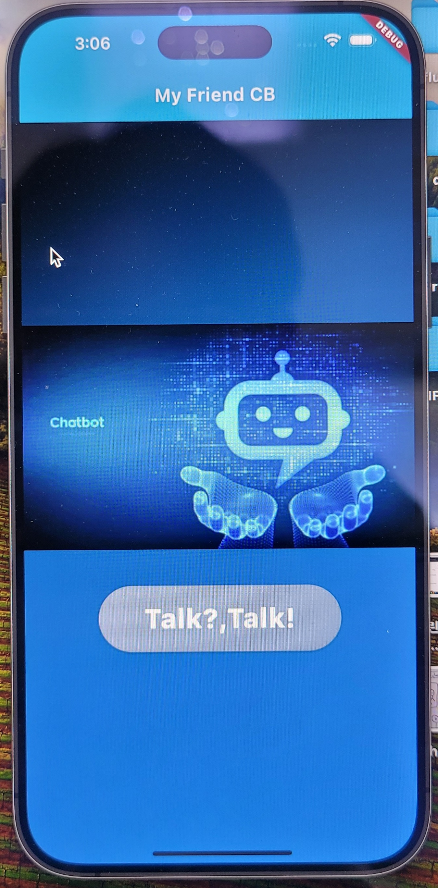
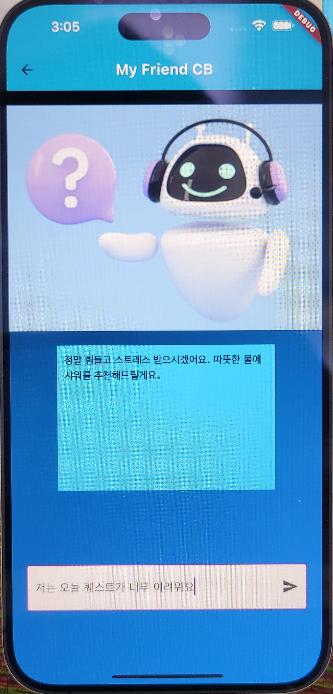
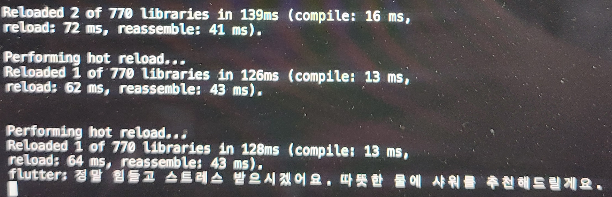
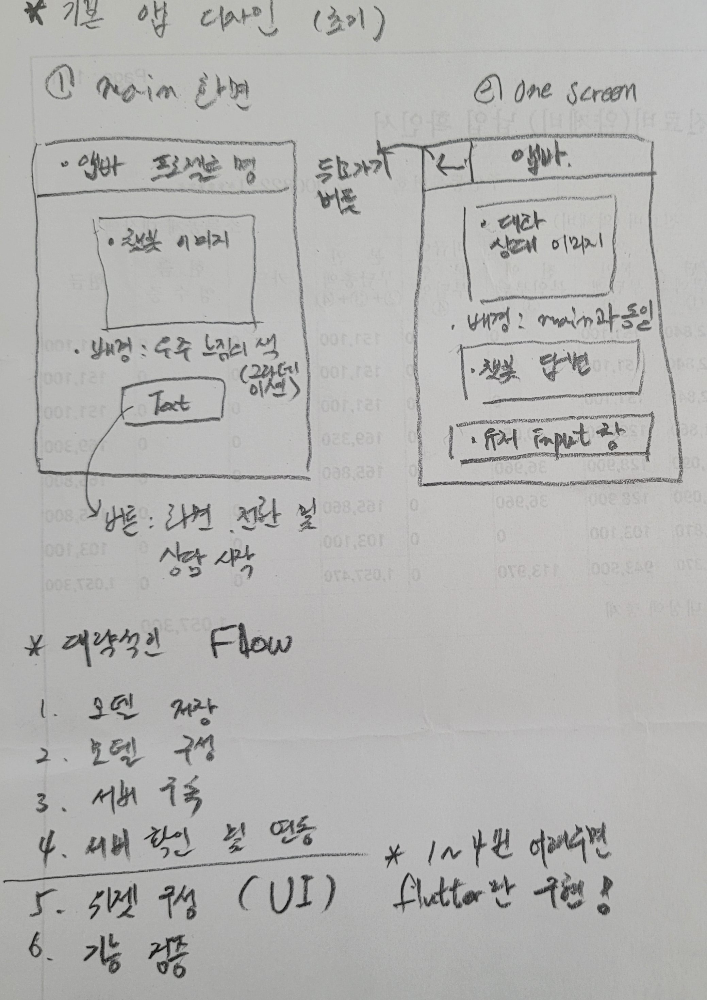

# Result 

---

# 1. 초기 디자인

---

# 2. 상세 과정
1. 챗봇 모델 저장 (model_save.py)(chatbot_model.pkl)
2. 서버 구축 (chatbot_server.py)
3. fastAPI로 서버 연동 및 기능 확인
4. flutter로 위젯 구성 (UI)
5. 로그를 통해 기능 검증 (* 챗봇 응답 특수기호 출력:해결)
6. 위젯 추가 꾸밈

---

# 3. 결과 및 문제점

* 답변 출력 시간 (30초) 
성능 개선 방안 : 모델 커스텀 부분에서 중복으로 작동 안해도 되는 기능 쪼개서 코드 구현(예상)

* 챗봇 응답 특수기호 출력 : 모델 임베딩 부분과 인코딩/디코딩 반환 과정 로그를 통해 확인하면서 코드 개선
UTF-8 타입 & JSON 형식으로 잘 주고 받는지 확인 매우 중요!

* Xcode Simulator에서 유저 입력 부분 한글 키보드 안됨
예상 되는 부분 : 모바일 플랫폼이라 로컬 키보드와 호환이 안되는 것이라 생각중 (추후 알아볼 예정)

---

# 4. 시작 전 위젯 구조 구성 계획
1. 메인화면과 1번 화면으로 2개의 화면 구성 (전체 배경/컨셉 우주 & AI)
2. 메인화면은 보라색 배경 앱바에 '프로젝트명'
3. assets에 있는 이미지를 앱바와 조금 띄우고 가운데에 배치
4. 이미지 아래에 1번 화면으로 넘어가는 '시작'버튼
5. 1번화면은 앱바의 leading 부분에 뒤로가기 버튼 삽입
6. 1번화면의 앱바도 '프로젝트명'
7. 1번 화면의 앱바와 조금 띄우고 애니메이션이 들어간 얼굴 이미지 삽입
8. 1번화면의 얼굴이미지 하단의 챗봇의 답변 container 삽입(배경 하늘색, 글씨 굵은 검은색)
9. 1번화면의 제일 하단에 유저가 입력할 컨테이너 삽입

